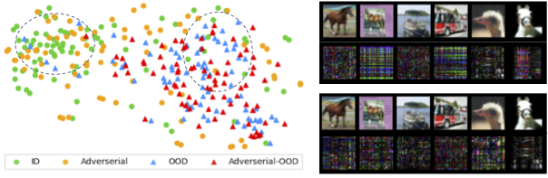

#  A Unified Perspective on Adversarial and Out-of-Distribution Detection in the Open World

We introduce an algebraic transformation based augmented training that, without sacrificing accuracy, reduces the sensitivity to adversarial attacks while enhancing OOD detection ability. Furthermore, we introduce a multi-level semantics design to increase classifiers’ resilience in the open world.

The left column shows a view of classification in the open world from its logits-space that is reduced to two dimensions by the t-SNE method. All samples are predicted as the dog class. ID samples are CIFAR10 images. Adversarial samples are ID with FGSM attack. OOD samples are SVHN images. The right column includes training samples transformed with our method SVrandom and normalized difference to their original CIFAR10 images.

This repository contains the implementation used for the results in our paper (https://arxiv.org/xxxx.xxxx).

## Citation

If you find this method or this code in your research, please please cite it:

    @article{
    }

## Prerequisites
* Python 3.6+
* PyTorch 1.8+

## Training
* Use `python train.py` to train a model with the default parameters.

## Evaluation
* Install [Torchattacks](https://github.com/Harry24k/adversarial-attacks-pytorch) 
* Use `python evaluate_cifar10.py --fname model/svrandom.pth` to run the evaluation with default parameters.

## Acknowledgement
The training schema and network are adapted from the [pytorch-cifar](https://github.com/kuangliu/pytorch-cifar) repository.
